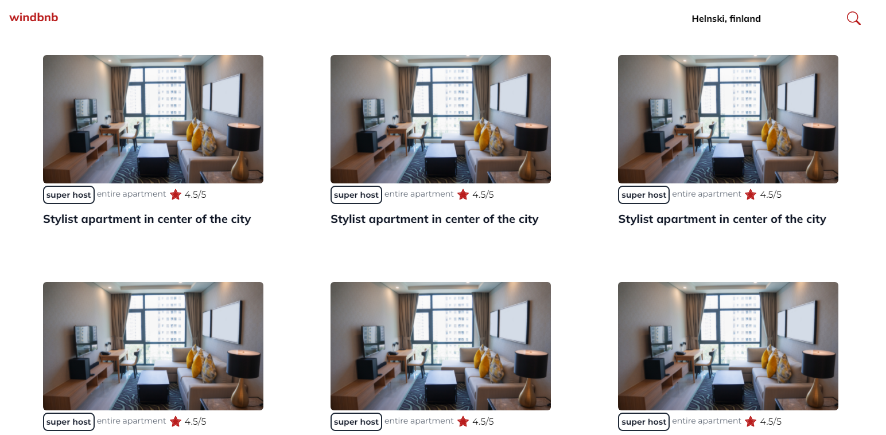

<!-- Please update value in the {}  -->

<h1 align="center">windbnb</h1>

<!-- TABLE OF CONTENTS -->

## Table of Contents

- [Overview](#overview)
  - [Built With](#built-with)
      [React & TailwindCSS](#built-with)

      

<!-- OVERVIEW -->

## Overview

- What was your experience?
      it was fun
- What have you learned/improved? 
      i improve my copy and paste skills!
- Your wisdom : "learn to copy and paste a block of code properly." 

<!-- This section should list any articles or add-ons/plugins that helps you to complete the project. This is optional but it will help you in the future. For exmpale -->

      
## Contact

- Twitter [@Ameeeekk](https://twitter.com/Ameeeekk)
- Facebook [Amek](https://www.facebook.com/ameeek.code/)
